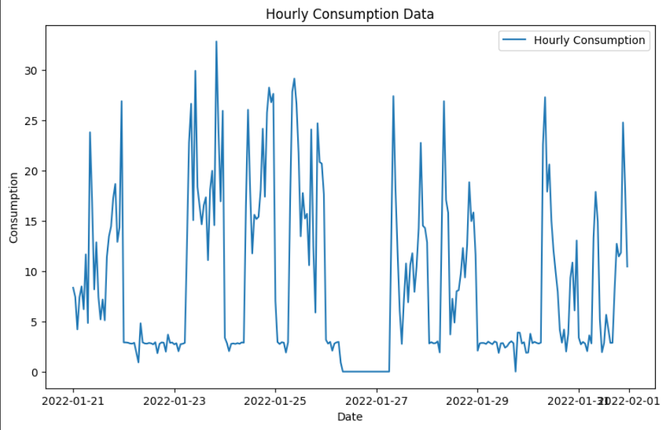
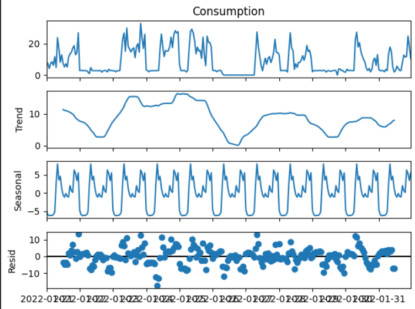
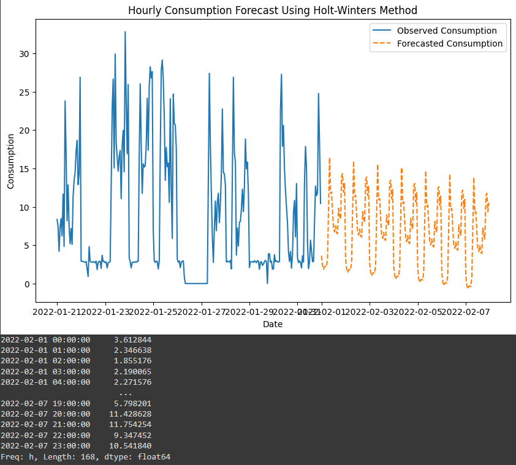

# Ex.No: 6               HOLT WINTERS METHOD
### Date: 
### Developed By: Shaik Shoaib Nawaz
### Register No: 212222240094


### AIM:
To create and implement Holt Winter's Method Model using python to predict consumption.

### ALGORITHM:
1. You import the necessary libraries
2. You load a CSV file containing daily sales data into a DataFrame, parse the 'date' column as
datetime, and perform some initial data exploration
3. You group the data by date and resample it to a monthly frequency (beginning of the month
4. You plot the time series data
5. You import the necessary 'statsmodels' libraries for time series analysis
6. You decompose the time series data into its additive components and plot them:
7. You calculate the root mean squared error (RMSE) to evaluate the model's performance
8. You calculate the mean and standard deviation of the entire sales dataset, then fit a Holt-
Winters model to the entire dataset and make future predictions
9. You plot the original sales data and the predictions
### PROGRAM:
```
# Step 1: Import necessary libraries
import pandas as pd
import numpy as np
import matplotlib.pyplot as plt
from statsmodels.tsa.holtwinters import ExponentialSmoothing
from statsmodels.tsa.seasonal import seasonal_decompose
from sklearn.metrics import mean_squared_error

# Step 2: Load dataset and parse the 'TxnDate' column as datetime
df = pd.read_csv('/content/KwhConsumptionBlower78_2.csv', parse_dates=[['TxnDate', 'TxnTime']])  # Combine 'TxnDate' and 'TxnTime'

# Step 3: Initial data exploration
print(df.head())  # Display first few rows
print(df.info())  # Data information
print(df.describe())  # Summary statistics

# Rename the combined date and time column
df.rename(columns={'TxnDate_TxnTime': 'TxnDateTime'}, inplace=True)

# Step 4: Set the 'TxnDateTime' as the index
df.set_index('TxnDateTime', inplace=True)

# Step 5: Resample the data to hourly frequency (sum of consumption per hour)
hourly_data = df['Consumption'].resample('H').sum()  # 'H' stands for hourly resampling

# Step 6: Plot the time series data
plt.figure(figsize=(10, 6))
plt.plot(hourly_data, label='Hourly Consumption')
plt.title('Hourly Consumption Data')
plt.xlabel('Date')
plt.ylabel('Consumption')
plt.legend()
plt.show()

# Step 7: Import statsmodels libraries for time series analysis
# (Already imported above)

# Step 8: Decompose the time series into its additive components and plot them
# Ensure that the data has a frequency and decompose using seasonal_decompose
hourly_data = hourly_data.asfreq('H')
decomposition = seasonal_decompose(hourly_data, model='additive', period=24)  # Assuming daily seasonality
decomposition.plot()
plt.show()

# Step 9: Train/Test Split and RMSE Calculation
# Split the data into train and test sets
train_data = hourly_data[:-24*7]  # Use all but the last 30 days (30*24 hours) for training
test_data = hourly_data[-24*30:]   # Last 30 days for testing

# Fit a Holt-Winters model to the training data
model = ExponentialSmoothing(train_data, trend='add', seasonal='add', seasonal_periods=24)  # 24-hour period
hw_model = model.fit()

# Make predictions for the test set
predictions = hw_model.forecast(len(test_data))

# Calculate RMSE
rmse = np.sqrt(mean_squared_error(test_data, predictions))
print(f'RMSE: {rmse}')

# Step 10: Mean and Standard Deviation of the entire dataset
mean_consumption = hourly_data.mean()
std_consumption = hourly_data.std()
print(f'Mean Consumption: {mean_consumption}')
print(f'Standard Deviation of Consumption: {std_consumption}')

# Step 11: Fit Holt-Winters model to the entire dataset and make future predictions
hw_full_model = ExponentialSmoothing(hourly_data, trend='add', seasonal='add', seasonal_periods=24).fit()
forecast_periods = 24 * 7  # Predict the next 7 days (7*24 hours)
future_predictions = hw_full_model.forecast(forecast_periods)

# Step 12: Plot the original consumption data and the predictions
plt.figure(figsize=(10, 6))
plt.plot(hourly_data, label='Observed Consumption')
plt.plot(future_predictions, label='Forecasted Consumption', linestyle='--')
plt.title('Hourly Consumption Forecast Using Holt-Winters Method')
plt.xlabel('Date')
plt.ylabel('Consumption')
plt.legend()
plt.show()

# Optionally, print the forecasted values
print(future_predictions)

```

### OUTPUT:


#### TEST_PREDICTION:




#### FINAL_PREDICTION:



### RESULT:
Thus the program is executed successfully based on the Holt Winters Method model.
